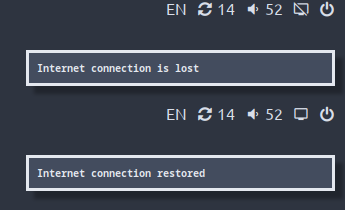

# Polybar Online

**Polybar Online** is a script for Polybar that displays an internet connection indicator
in a
panel with the ability to send a notification when the connection is broken and restored.

<div align="center">
  
</div>

## Why another one?

I've been looking for a similar module for myself and even found a couple. But they didn't
run on my machine... So I decided that it would be faster to write my own than to poke
around in someone else's. (and others are not able to send notifications!!!)

## Requirements

The script does not use any third-party libraries, but you will need to install some
[Nerd fonts](https://github.com/ryanoasis/nerd-fonts) in order for the icons to be displayed.

It's not necessary if you're going to use your own icons from other fonts, though.

## Installing

Clone the repository to a convenient location. For example, in `~/.config/polybar/`:

```shell
cd ~/.config/polybar/
git clone https://github.com/Leetovskiy/polybar-online 
```

You can also install Polybar Online from PyPI using `pip`. In this case, you may want to
run the script as a regular console program. To do this, make sure that the directory of
installed pip packages is available in the `PATH` variable.

```shell
pip install polybar-online
```

## Configuration

The script takes some arguments from the terminal to control its operation. These are, for
example, enabling and disabling Internet connection status change notifications, setting
icons, etc.

Use the command `polybar-online -h` to see the full list of available options.

```
  -h, --help            show this help message and exit
  -n, --notify, --no-notify
                        send a notification if the internet connection is broken (default: False)
  --online-icon ONLINE_ICON
                        icon that will be displayed when the Internet connection is available (default: 度)
  --offline-icon OFFLINE_ICON
                        icon that will be displayed when there is no Internet connection (default: ﴹ)
  -ci CHECK_INTERVAL, --check-interval CHECK_INTERVAL
                        Interval between checks (in seconds)
  -ri RETRY_INTERVAL, --retry-interval RETRY_INTERVAL
                        Interval between checks when Internet connection is unavailable (in seconds)
```

## Using

You need to put the script path in a special `custom/script` section of your Polybar
configuration file. You also need the tail parameter set to true. And don't forget to add
the new module to your panel's module list.

Example:

```ini
[bar/mybar]
modules-right = online

[module/online]
type = custom/script
exec = python ~/.config/polybar/polybar-online/polybar_online/main.py --notify -ci 5
tail = true
```

## License

This little project is licensed under the Apache 2.0 license, so you are free to use it
according to the terms of the license.

## Contribution

If you know how to improve this project or would like to contribute yourself, you are
welcome. I'm open to suggestions on Telegram ([@leetovskiy](https:/t.me/leetovskiy)) and
email ([dev.zaitsev@gmail.com](mailto:dev.zaitsev@gmail.com)), and I'll consider pull
requests from you as well.

## Roadmap

- [ ] Localization in Russian and other languages
- [ ] Distribution as a binary (using nuitka)
- [ ] AUR package